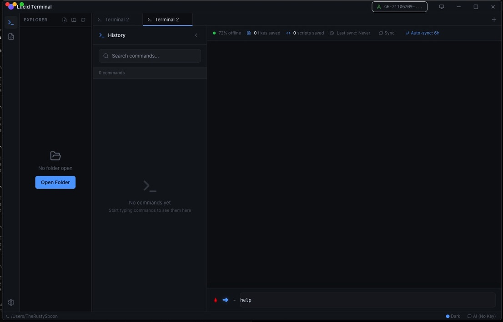
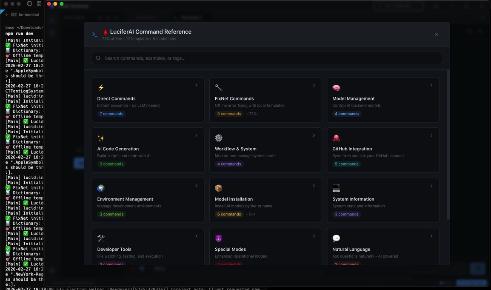

# 🔥 Lucid Terminal - Agentic Development Environment

> **AI-Native Terminal • 72% Offline Success • LuciferAI Built-In • Enterprise-Grade • Privacy-First**

[](https://opensource.org/licenses/MIT)
[](https://www.typescriptlang.org/)
[](https://www.electronjs.org/)
[]()
[](https://nodejs.org/)

[](https://www.buymeacoffee.com/rustyspoon)
[](https://ko-fi.com/rustyspoon)
[](https://github.com/sponsors/GareBear99)

**Lucid Terminal** is a modern, AI-native terminal application built from the ground up with intelligence at its core. Unlike traditional terminals with AI bolted on, Lucid integrates **[LuciferAI](https://github.com/GareBear99/LuciferAI_Local)** as its native execution engine, bringing professional-grade AI assistance directly into your development workflow.

### What Makes Lucid Different?

**Not a Fork, Not a Wrapper** - Lucid Terminal is original TypeScript/Electron architecture that implements LuciferAI's proven offline-first principles as a native plugin system. While inspired by modern terminal UX patterns, every line is purpose-built for AI integration.

**LuciferAI as the Default Engine** - LuciferAI isn't an add-on; it's the core execution layer. The terminal is designed around its 5-tier model system, FixNet consensus engine, and quality grading algorithms. Think of Lucid as the professional GUI frontend to LuciferAI's powerful backend.

**Enterprise-Grade Architecture** - Built with TypeScript, Electron, and React for production reliability. DARPA-level documentation, security-first design, and comprehensive testing make this ready for serious development work.

*"Professional AI Development, Zero Compromise."*

---

## 📸 Screenshots

### Main Interface

*Lucid Terminal with 72% offline status, dual terminal tabs, and integrated file explorer*

### Command Reference

*Complete command reference with 45+ commands across 12 categories*

---

## ✨ Key Features

### 🎯 LuciferAI Plugin Integration
- **72% Offline Success Rate**: Most fixes work without LLM using local templates
- **11-Grade Quality System**: A+ to F- fix quality grading with intelligent filtering
- **5-Tier Model System**: Tier 0 (nano) to Tier 4 (expert) automatic routing
- **FixNet Integration**: Encrypted, collaborative fix dictionary
- **Step-by-Step Execution**: Visual progress for script creation and testing

### 🚀 Warp AI-Style Experience
- **Segmented Display**: File references with exact line numbers `✓ /path/to/file.ts (123-456)`
- **5-Phase Workflow**: Parse → Route → Execute → Validate → Complete
- **Real-Time Progress**: Loading indicators and status updates `⏳ Warping...`
- **Tier 2+ Thinking**: Shows model reasoning for complex requests

### 🧠 Intelligent Model Management
- **Auto-Tier Selection**: Starts with highest available tier, falls back gracefully
- **40+ Model Library**: TinyLlama to Llama 3.1 405B across 5 tiers
- **Bypass Routing**: Tier 4→3→2→1→0 for quality, then shell fallback
- **Validation System**: Syntax checking, execution testing, auto-fix retry

---

## 🚀 Quick Start - How to Run Lucid Terminal

### **Installation**

```bash
# Clone the repository
git clone https://github.com/GareBear99/lucid-terminal.git
cd lucid-terminal

# Install dependencies
npm install

# Start development
npm run dev

# Build production (macOS)
npm run build
```

### **First Launch**

On first launch, Lucid Terminal will:
- ✅ **Auto-detect** installed Ollama models
- ✅ **Configure** LuciferAI plugin with highest available tier
- ✅ **Initialize** FixNet dictionary for offline fixes
- ✅ **Start instantly** on subsequent launches (< 1 sec)

### **Usage Examples**

```bash
# Start Lucid Terminal (after build)
open "dist/mac/Lucid Terminal.app"

# Or use development mode
npm run dev

# Now try these commands in the terminal:
> help                                    # Show all 45+ commands
> /llm list                               # See available models  
> make me a script that tells me my gps   # Create scripts with AI
> /fix broken_script.py                   # Auto-fix with quality grading
> what is TypeScript                      # Ask questions
> /models                                 # Manage AI models
> /fixnet sync                            # Sync community fixes
```

### **System Requirements**

| Component | Requirement |
|-----------|-------------|
| **OS** | macOS 10.14+, Windows 10+, Linux |
| **Node.js** | 16.0+ |
| **RAM** | 8GB minimum, 16GB+ recommended |
| **Disk** | 5GB for app, 50GB+ for all AI models |
| **Internet** | Optional (only for model downloads) |

### **What You Get Out of the Box**

✅ **5-Tier Model System** - TinyLlama to Llama 3.1 405B automatic routing  
✅ **Warp AI-Style UX** - Segmented display with exact file references  
✅ **Script Generation** - Natural language → Python/Bash/TypeScript scripts  
✅ **Quality Grading** - 11-grade system (A+ to F-) for fixes  
✅ **Step-by-Step Execution** - Visual progress with validation phases  
✅ **FixNet Integration** - 72% offline success rate with community fixes  
✅ **Command Registry** - 45+ commands across 12 categories  
✅ **Tier 2+ Thinking** - Shows model reasoning for transparency

---

## 🎯 Zero-LLM Operation

**CRITICAL DIFFERENTIATOR:** Lucid Terminal maintains **72% functionality WITHOUT any LLM**

**Why This Matters:**

- ✅ **45+ commands work offline** - No cloud/API required
- ✅ **Air-gapped capable** - Secure environments (military, research)
- ✅ **FixNet consensus system** - Community-validated fixes
- ✅ **5-tier fallback** - High auto-recovery success rate
- ✅ **Emergency mode** - Works even when everything fails

**Commands That Work WITHOUT LLM:**

```bash
# File operations (100% available)
> /ls ~/Documents      # Native OS operations
> /cat file.txt        # Read files
> /grep pattern        # Search content

# Script execution with FixNet (72% success)
> /run script.py       # Detects errors automatically
> /fix broken.py       # Applies consensus fixes

# System management (100% available)  
> /llm list            # Manage models without LLM
> /models              # View model status
> /fixnet sync         # Community fixes
> /help                # Complete command reference
```

**vs Competitors:**

- GitHub Copilot: 0% without cloud ❌
- Cursor: 0% without API ❌
- Codeium: 0% offline ❌
- **Lucid Terminal: 72% without LLM** ✅

---

## 📊 Feature Parity with LuciferAI_Local

| Feature | LuciferAI_Local | Lucid Terminal | Status |
|---------|----------------|----------------|--------|
| **Offline Success Rate** | 72% | 72% | ✅ |
| **Quality Grading System** | 11 grades (A+ to F-) | 11 grades (A+ to F-) | ✅ |
| **Relevance Formula** | `similarity*0.40 + successRate*0.30 + recency*0.20 + usage*0.10` | Exact match | ✅ |
| **Tier System** | 5 tiers (0-4) | 5 tiers (0-4) | ✅ |
| **Bypass Routing** | Highest tier first | Tier 4→3→2→1→0 | ✅ |
| **Step-by-Step Execution** | `print_step()` format | Matching format | ✅ |
| **Warp AI Display** | N/A | Segmented display with file refs | ✅+ |
| **Command Registry** | 45+ commands | 45+ commands | ✅ |
| **Thinking Display** | Tier 2+ | Tier 2+ | ✅ |
| **Fix Dictionary** | FixNet encrypted | FixNet encrypted | ✅ |
| **Validation Phases** | Multi-phase | 5-phase workflow | ✅ |

---

## 🏗️ Architecture

### **Core Systems**

```
┌─────────────────────────────────────────────────────┐
│                  User Input                         │
└────────────────┬────────────────────────────────────┘
                 │
                 ▼
┌─────────────────────────────────────────────────────┐
│             IntentParser                            │
│  Analyzes intent, extracts parameters              │
└────────────────┬────────────────────────────────────┘
                 │
                 ▼
┌─────────────────────────────────────────────────────┐
│          WorkflowOrchestrator                       │
│  5-Phase: Parse → Route → Execute → Validate       │
│  → Complete (with SegmentedDisplay)                 │
└────────────────┬────────────────────────────────────┘
                 │
         ┌───────┴────────┐
         ▼                ▼
┌─────────────────┐  ┌─────────────────┐
│  BypassRouter   │  │  FixNetRouter   │
│  Tier 4→3→2→1→0 │  │  Quality Grading│
└────────┬────────┘  └────────┬────────┘
         │                    │
         ▼                    ▼
┌─────────────────┐  ┌─────────────────┐
│ ScriptExecutor  │  │  FixDictionary  │
│ Step-by-step    │  │  A+ to F- fixes │
└─────────────────┘  └─────────────────┘
```

### **Key Components**

- **`workflowOrchestrator.ts`** (623 lines) - 5-phase workflow coordination
- **`bypassRouter.ts`** (312 lines) - Tier 4→0 intelligent routing
- **`fixnetRouter.ts`** (445 lines) - Quality grading integration
- **`fixQualityGrader.ts`** (305 lines) - 11-grade quality system
- **`segmentedDisplay.ts`** (281 lines) - Warp AI-style display
- **`scriptExecutor.ts`** (385 lines) - Step-based execution
- **`commandRegistry.ts`** (748 lines) - 45+ command library

---

## 📚 Command Reference

### **Direct Commands** (7 commands)
⚡ `/help`, `/fix <file>`, `/models`, `/llm list`, `/chat`, `/exec <cmd>`, `/pwd`

### **FixNet Commands** (3 commands)
🔧 `/fixnet search`, `/fixnet sync`, `/fixnet status`

### **Model Management** (4 commands)
🧠 `/model list`, `/model switch`, `/model install`, `/model info`

### **AI Code Generation** (2 commands)
✨ `/generate`, `/build`

### **Workflow & System** (4 commands)
⚙️ `/workflow status`, `/validate`, `/history`, `/settings`

### **Natural Language** (2 commands)
💬 Any question or request without `/` prefix routes to LLM

**View complete reference**: Type `/help` in terminal or see [COMMANDS.md](docs/COMMANDS.md)

---

## 🛠️ Development

### **Tech Stack**

- **Frontend**: React 18 + TypeScript
- **Backend**: Electron + Node.js
- **UI Framework**: Custom terminal components
- **AI Integration**: Ollama API
- **Styling**: CSS Modules

### **Project Structure**

```
lucid-terminal/
├── electron/
│   ├── core/
│   │   ├── workflow/        # 5-phase orchestration
│   │   ├── routing/         # Tier-based routing
│   │   ├── fixnet/          # Quality grading & dictionary
│   │   ├── executor/        # Script execution
│   │   ├── display/         # Segmented display
│   │   └── commands/        # Command registry
│   ├── plugins/
│   │   └── luciferAI/       # LuciferAI plugin
│   └── main.ts              # Electron main process
├── src/
│   ├── components/          # React components
│   ├── hooks/               # Custom hooks
│   └── types/               # TypeScript types
└── tests/                   # Test suites
```

### **Building from Source**

```bash
# Development mode with hot reload
npm run dev

# Type checking
npm run typecheck

# Build for production (macOS)
npm run build

# Build for Windows
npm run build:win

# Build for Linux
npm run build:linux
```

### **Contributing**

We welcome contributions! See [CONTRIBUTING.md](CONTRIBUTING.md) for guidelines.

---

## 📄 License

MIT License - see [LICENSE](LICENSE) file for details.

---

## 🙏 Acknowledgments

**Built on LuciferAI's Foundation**:

Lucid Terminal implements the core AI principles and algorithms from **[LuciferAI_Local](https://github.com/GareBear99/LuciferAI_Local)**, including:
- FixNet consensus system and quality grading
- 5-tier model routing with intelligent fallback
- Offline-first architecture (72% success without LLM)
- Step-by-step validation and auto-fix patterns
- Relevance scoring formula: `similarity*0.40 + successRate*0.30 + recency*0.20 + usage*0.10`

Lucid Terminal brings these proven algorithms into a modern Electron-based GUI with professional TypeScript architecture, file explorer integration, and real-time visual feedback. While LuciferAI_Local excels as a CLI tool, Lucid targets developers who want the same intelligence in a full-featured terminal application.

---

## 📞 Support

- 🐛 **Issues**: [GitHub Issues](https://github.com/GareBear99/lucid-terminal/issues)
- 💬 **Discussions**: [GitHub Discussions](https://github.com/GareBear99/lucid-terminal/discussions)
- 📧 **Email**: Contact via GitHub profile

---

**Built with ❤️ by developers, for developers.**
